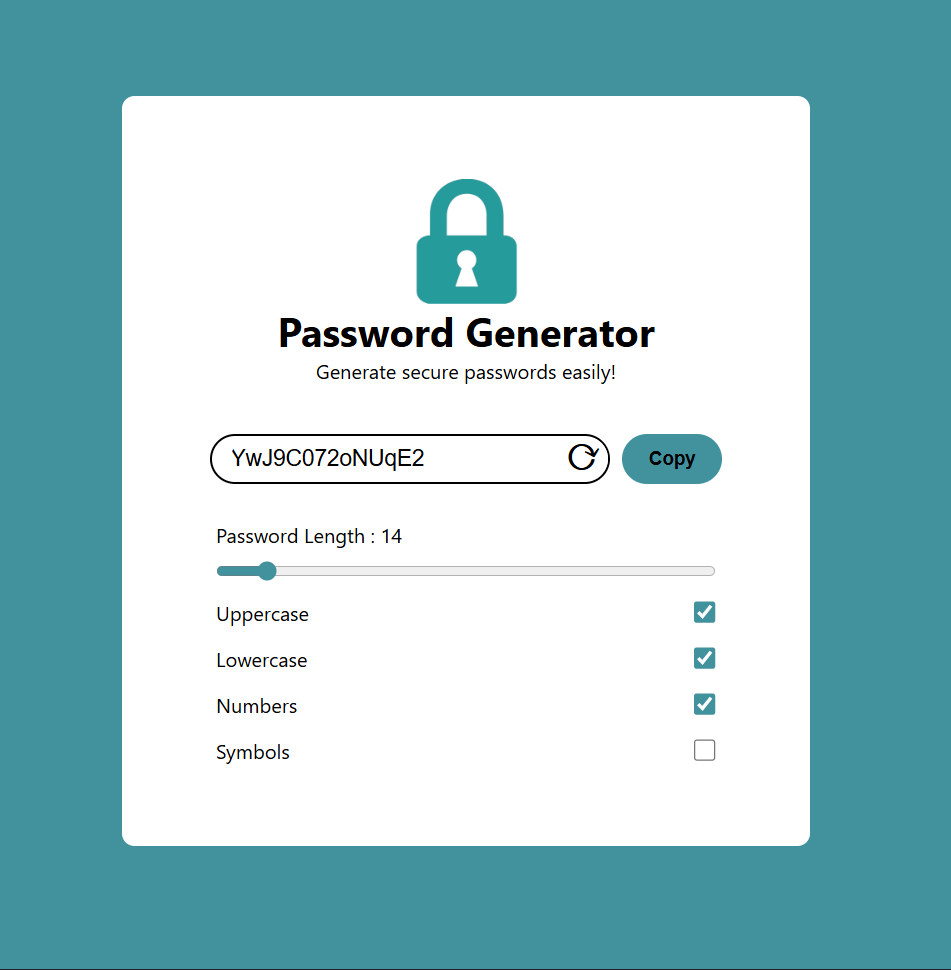

# 🔐 Password Generator

A modern, secure password generator built with React and Vite. Generate strong, customizable passwords with an intuitive and beautiful user interface.



## ✨ Features

- **Customizable Length**: Generate passwords from 6 to 100 characters
- **Character Options**: 
  - Uppercase letters (A-Z)
  - Lowercase letters (a-z)
  - Numbers (0-9)
  - Special symbols (!@#$%^&*()_+~`|}{[]:;?><,./-=)
- **Real-time Generation**: Password updates automatically when options change
- **Refresh Button**: Regenerate password with current settings
- **Copy to Clipboard**: Quick copy functionality (coming soon)
- **Responsive Design**: Works seamlessly on all devices
- **Modern UI**: Clean, gradient-based interface with smooth animations

## 🚀 Getting Started

### Prerequisites

- Node.js (v14 or higher)
- npm or yarn

### Installation

1. Clone the repository:
```bash
git clone https://github.com/Tarun-1009/password-generator.git
cd password-generator
```

2. Install dependencies:
```bash
npm install
```

3. Start the development server:
```bash
npm run dev
```

4. Open your browser and navigate to `http://localhost:5173`

## 📖 Usage

1. **Adjust Password Length**: Use the slider to set your desired password length (6-100 characters)
2. **Select Character Types**: Check/uncheck the boxes to include:
   - Uppercase letters
   - Lowercase letters
   - Numbers
   - Symbols
3. **Generate**: The password generates automatically, or click the refresh button (⟳) to create a new one
4. **Copy**: Click the "Copy" button to copy the password to your clipboard

## 🛠️ Built With

- **React** (v19.2.0) - UI library
- **Vite** (v7.2.4) - Build tool and dev server
- **CSS3** - Styling with modern gradients and animations
- **JavaScript (ES6+)** - Core functionality

## 📦 Available Scripts

- `npm run dev` - Start development server
- `npm run build` - Build for production
- `npm run preview` - Preview production build
- `npm run lint` - Run ESLint

## 🎨 Features Breakdown

### Security
- Uses `Math.random()` for password generation
- Supports all standard password character types
- Configurable length for varying security levels

### User Experience
- Instant feedback with real-time password generation
- Visual slider for length selection
- Clear checkbox options for character types
- Refresh button for quick regeneration

## 🤝 Contributing

Contributions, issues, and feature requests are welcome! Feel free to check the issues page.

## 📝 License

This project is open source and available under the [MIT License](LICENSE).

## 👤 Author

**Tarun**
- GitHub: [@Tarun-1009](https://github.com/Tarun-1009)

## 🌟 Show your support

Give a ⭐️ if this project helped you!

---

Made with ❤️ using React and Vite